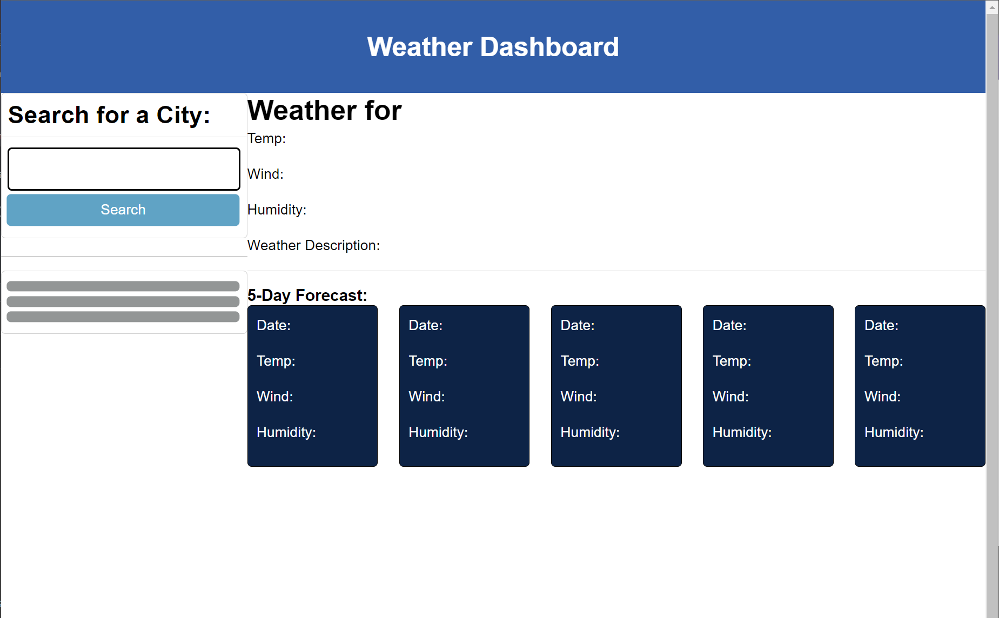

# Weather Dashboard

## Description

I was given the challenge of creating a weather application that will run in the browser and feature dynamically updated HTML and CSS. The user must be able to search for a city and then be presented with the current forecast, and the forecast for the following 5 days. The date, temperature, wind speed, and humidity should also be displayed. During the building process, I learned how to use third-party APIs to access their data and functionality by making specific requests to a URL.

## Usage

I created a weather application that runs in the browser. The app consists of a search box in the upper left corner to enter the name of the city. Once the name of the city is entered, the name, date and current forecast are shown in the center of the screen. Also, the 5-day forecast will appear in blue boxes underneath. I used a third-party API to access their data and functionality to dynamically update my HTML and CSS to populate all the forecast data.

## Credits

Throughout the making of this project, I frequently referenced https://openweathermap.org/api and my class repository ASU-VIRT-FSF-PT-10-2023-U-LOLC. I also referenced Google, W3Schools, MDN Webdocs, Day.js, Bootstrap, and ChatGPT. I also worked with a tutor, Trinh Nguyen, who helped me with some mistakes that I made.

## License

MIT License

Copyright (c) [2023] [jaschmidt22]

Permission is hereby granted, free of charge, to any person obtaining a copy of this software and associated documentation files (the "Software"), to deal in the Software without restriction, including without limitation the rights to use, copy, modify, merge, publish, distribute, sublicense, and/or sell copies of the Software, and to permit persons to whom the Software is furnished to do so, subject to the following conditions:

The above copyright notice and this permission notice shall be included in all copies or substantial portions of the Software.

THE SOFTWARE IS PROVIDED "AS IS", WITHOUT WARRANTY OF ANY KIND, EXPRESS OR IMPLIED, INCLUDING BUT NOT LIMITED TO THE WARRANTIES OF MERCHANTABILITY, FITNESS FOR A PARTICULAR PURPOSE AND NONINFRINGEMENT. IN NO EVENT SHALL THE AUTHORS OR COPYRIGHT HOLDERS BE LIABLE FOR ANY CLAIM, DAMAGES OR OTHER LIABILITY, WHETHER IN AN ACTION OF CONTRACT, TORT OR OTHERWISE, ARISING FROM, OUT OF OR IN CONNECTION WITH THE SOFTWARE OR THE USE OR OTHER DEALINGS IN THE SOFTWARE. Copy license text to clipboard Suggest this license Make a pull request to suggest this license for a project that is not licensed. Please be polite: see if a license has already been suggested, try to suggest a license fitting for the project’s community, and keep your communication with project maintainers friendly.
